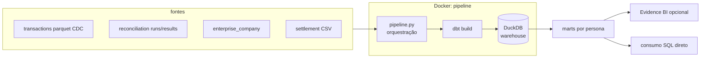

# Arquitetura

## 3.1 Fluxo local (o que está neste repo)



Camadas no DuckDB: **staging** (views de limpeza — dedup de CDC, tipos, normalização de
valores) → **intermediate** (motor de reconciliação) → **marts** (dimensão + 3 tabelas
por persona, incrementais e idempotentes por `reference_date`).

## 3.2 Desenho de produção

O container roda sem mudanças em qualquer runtime de containers. Dois desenhos
equivalentes — a escolha é da infraestrutura da casa, não do pipeline:

**AWS**

```
CSV chega no S3 ──► EventBridge (evento de objeto)
                        │
                        ▼
              Step Functions (retry, catch, notificação SNS)
                        │
                        ▼
              ECS Fargate task ── mesmo container: pipeline.py + dbt
                        │
                        ▼
        warehouse (Redshift/Athena; parquet no S3 no início)
                        │
                        ▼
        BI (Evidence/QuickSight) + consumo SQL
```

**GCP**

```
CSV chega no GCS ──► Eventarc
                        │
                        ▼
              Cloud Workflows (retry, catch, notificação)
                        │
                        ▼
              Cloud Run Job ── mesmo container
                        │
                        ▼
              BigQuery (dbt-bigquery: troca de adapter, modelos iguais)
                        │
                        ▼
              BI + consumo SQL
```

Decisões comuns aos dois desenhos:

- **Disparo por evento** (chegada do arquivo), não por horário: elimina a classe de
  falha "rodou antes do arquivo chegar". Um agendamento diário de *verificação* ("chegou
  arquivo até 8h?") cobre o caso "arquivo nunca chegou".
- **Orquestrador genérico basta** (Step Functions/Cloud Workflows): o DAG de
  transformações pertence ao dbt. Airflow/Dagster entraria se surgissem muitos pipelines
  interdependentes com backfills frequentes — para um pipeline linear diário, o custo
  operacional não se justifica.
- **CDC gerenciado** (DMS na AWS, Datastream no GCP) alimentando a camada raw em objeto
  — o formato `Op`/`_timestamp` dos extratos deste case é exatamente o que essas
  ferramentas produzem.
- **IaC**: Terraform. Esqueleto ilustrativo (não aplicado) dos recursos-chave na AWS:

```hcl
resource "aws_s3_bucket" "settlement_landing" { bucket = "..." }
resource "aws_ecs_task_definition" "pipeline" { /* container deste repo */ }
resource "aws_sfn_state_machine" "reconciliation" { /* validate -> run -> notify */ }
resource "aws_cloudwatch_event_rule" "file_arrival" { /* s3 object created */ }
resource "aws_sns_topic" "pipeline_alerts" {}
```

- **CI (implementado neste repo)**: GitHub Actions — lint (ruff) → build da imagem →
  testes no container → pipeline completo no fixture. O mesmo container validado no CI é
  o que seria implantado.

## 3.3 Troubleshooting: "dashboards sem dados desde sexta"

Investigação em ordem de custo — cada passo tem um artefato objetivo a consultar:

1. **O pipeline rodou?** Histórico de execuções do orquestrador (Step Functions/Cloud
   Run) desde sexta. Não rodou → problema de disparo: o arquivo chegou no bucket? O
   evento disparou?
2. **Rodou e falhou?** Logs estruturados do `pipeline.py` apontam a etapa: exit 2 =
   entrada faltando (arquivo não chegou/nome errado — acionar o processador); exit 1 =
   transformação ou teste falhou.
3. **Falhou em teste de qualidade?** A saída do `dbt build` nomeia o teste e a tabela.
   Teste bloqueante (grão duplicado, chave nula) segurou o load — é o sistema protegendo
   o downstream; o defeito está no dado que chegou, não no pipeline.
4. **Rodou com sucesso mas dashboard vazio?** O warehouse tem dados para a data?
   (`select max(reference_date) from mart_operations`). Tem → problema no BI
   (cache/conexão); não tem → data errada processada (fuso? `reference_date` derivada
   errado?).
5. **Só então escalar** — já sabendo: última execução boa, primeiro dia ruim, etapa
   exata da falha e mensagem de erro.

Prevenção embutida no desenho: alarme de "nenhuma execução com sucesso até 9h", teste de
frescor (freshness) no warehouse, e o cross-check motor × serviço como detector de
divergência silenciosa.

## 3.4 Escalabilidade: 5M transações/dia em 18 meses

Medido neste repo: 1M de linhas processadas em ~8s (DuckDB é colunar e o motor é um join
por dia). O gargalo não é o volume diário — é o desenho ao redor. Onde quebra primeiro,
em ordem:

**1. Um único arquivo DuckDB.** Sem escritores concorrentes: qualquer segundo
consumidor/escritor briga pelo lock. Primeira mudança real de engine: warehouse
gerenciado (BigQuery/Redshift) ou lakehouse (parquet particionado + engine de leitura).

**2. Staging em full scan.** Hoje o staging lê `transactions_batch_*.parquet` inteiro a
cada execução: o custo da run diária cresce com o tamanho da *história*, não do dia. Com
5M/dia, um ano de CDC ≈ 1,8B de linhas varridas para usar ~40M (janela de 7 dias). A
evolução vem em degraus:

- *Degrau 1 — particionar a raw por data* (`dt=YYYY-MM-DD/`): o engine poda a leitura
  pelas pastas (partition pruning) e abre só a janela necessária. Custo por run volta a
  ser proporcional à janela. Nuance de CDC: um update de transação antiga chega no
  arquivo de hoje, então a poda deve ser por "eventos chegados recentemente", não por
  data de criação da transação.
- *Degrau 2 — ingestão incremental com watermark*: manter uma tabela de estado
  persistida e aplicar via MERGE apenas os arquivos ainda não processados (registro de
  ingestão). Custo por run proporcional ao dia. Formatos de tabela (Iceberg/Delta) ou o
  warehouse gerenciado dão o MERGE transacional pronto. Não implementado aqui de
  propósito: com 2 arquivos estáticos no fixture, seria estado e complexidade sem massa
  que os exercite — no volume atual, view sem estado é objetivamente mais simples e
  igualmente correta.

**3. Histórico do `mart_compliance`.** Grão transação: ~150M linhas/mês em 5M/dia.
Particionamento por `reference_date` + política de retenção quente/fria (ex.: 13 meses
online, resto em objeto).

**4. A janela de 7 dias como full outer join.** Em 5M/dia o join diário é ~35M × 5M —
tratável em warehouse colunar, mas vale partição por `reference_date` e bucketing por
`transaction_id`.

**O que NÃO muda com a escala:** os modelos dbt (SQL portável entre DuckDB e
BigQuery/Redshift com ajustes mínimos), os contratos e testes, o motor de reconciliação,
os marts e suas garantias de idempotência. A migração é de engine, não de lógica — esse
foi o critério do desenho.
